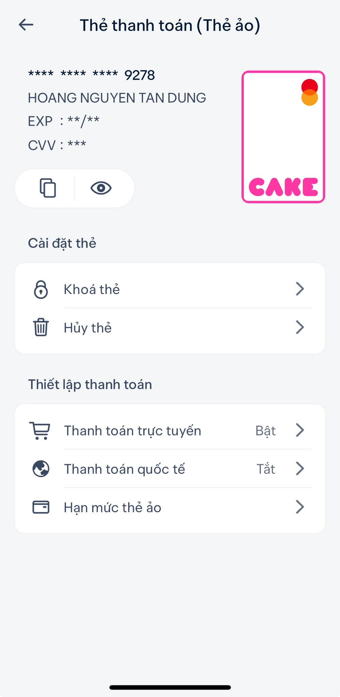

# Bot_răm.exe

```
>>> pip install -r /path/to/requirements.txt
```
Nhập và gửi **/help** để xem các slash command.
<!-- Tải FFmpeg tại [ffmpeg.org](https://ffmpeg.org/download.html), copy 3 file .exe vào thư mục bin. Tự tạo **secret.py** nhé. -->


# Hosting Bot cả ngày ?
- Tạo VM trên [Google Cloud](https://console.cloud.google.com/) (mục **Compute Engine**), bảo free 1 năm mà cho 3 tháng, lừa.
- Nếu bần vl không có Visa hay MasterCard, có thể dùng thẻ ảo (MasterCard) trên **CAKE**.

